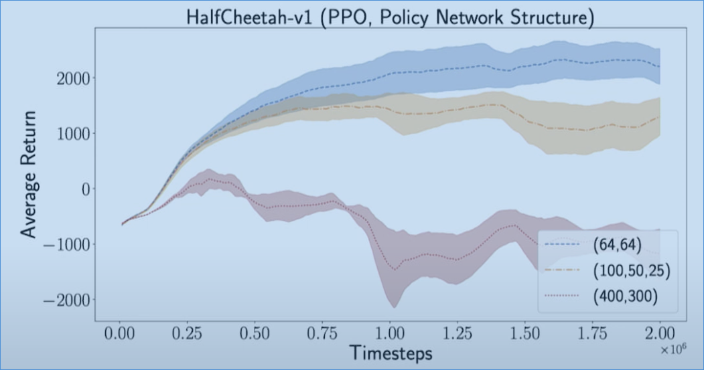
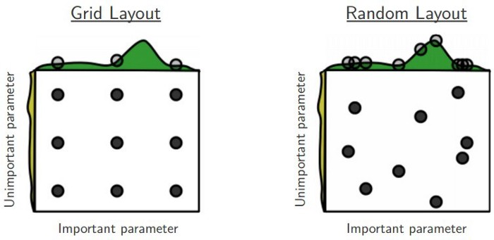
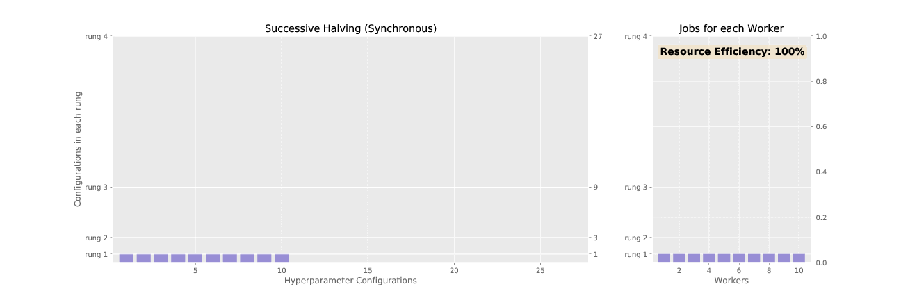
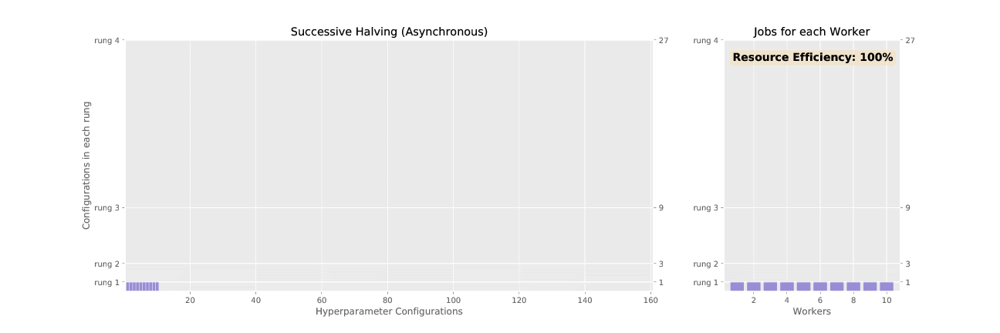
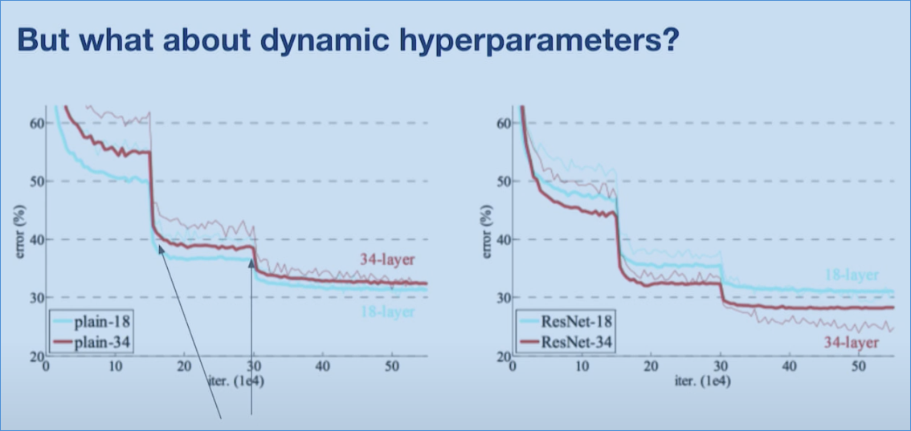

# Hyperparameter Tuning with ray[tune]

## Why Hyperparameter Tuning?

Modern ML models are based on neural networks and highly dependent on hyperparameters. But also standard ml methods like Regression can benefit from automatic tuning pipelines.
Also hyperparameters can change with new data, data size and so on.

A typical training loop can be written like:
```python
def train_model():
    model = ConvNet()
    optimizer = Optimizer()
    for batch in Dataset():
        loss, accuracy = model.train(batch)
        optimizer.update(model, loss)
```
But training costs money and time! And in the background there are a lot of parameters to set and tune:

```python
def train_model():
    model = ConvNet(layers, activations, ....)
    optimizer = Optimizer(learningrate, momentum, decay,...)
    for batch in Dataset(batchsize, standardize, shift, ...):
        loss, accuracy = model.train(batch)
        optimizer.update(model, loss)
```
Computer Vision models often take hours, days or weeks to finish one training.

Influence of Model Size on performance


### Goal of Hyperparameter Tuning:

- Maximize Model Performance
- Minimize Time spent
- Minimize Money spent


## Sequential Optimisation

Sequential Optimisation like simple By-Hand-Tuning often leads to the best performing hyperparameter sets but are the slowest and most cost intensive methods.
Examples are:
- By-Hand-Tuning
  - very time consuming 
  - expensive
  - biased by user
- Bayesian Methods
  - leads to very good performing models
  - time consuming because of lack of parallelisation

## Parallel Search: Grid Search

Speed up search by parallelising trials. **Trial** or experiment is a set of hyperparameters that is trained.
Simply define a grid as a hyperparameter space
```python
space= {
            "batch_size": hp.choice("batch_size", [32, 64, 128]),
            "learning_rate": hp.choice("learning_rate", [0.01, 0.001, 0.0005]),
            "target_update": hp.choice("target_update", [4, 10, 100]),
            }
```

This approach is often a simple but huge improvement to optimise your model

## Parallel Search: Random Search

Instead of setting a grid for the hyperparameter space we can define a range and a sampling method:

```python
space= {
            "batch_size": hp.choice("batch_size", [32, 64, 128]),
            "learning_rate": hp.loguniform("learning_rate", [0.0001, 0.01]),
            "target_update": hp.uniform("target_update", [4, 100]),
            }
```



Also in high dimensinal spaces the random search outperformce most other methods.
Still these simple parallel methods are inefficient and expansive

## Adaptive Selection Methods


### HyperBand(SHA) / ASHA

HyperBand and Asynchronous HyperBand, ASHA, are early stopping methods.

```python
trial = sample_from(space)
while trial.iter < max_epochs:
    tiral.run_epoch()
    if trial.early_stop():
        if is_top_performer(trial, trial.iter):
            trial.extend_early_stop()
        else:
            trial.stop()
```

**rung** are sets of trials that are started within a resource block of workers.

The standard HyperBand uses the resources as follows:



ASHA uses free resources for new **rung's**


## Population Based Training, PBT


