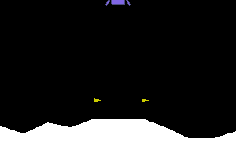

### Hyperparametertuning Demo

This is a demo for hyperparameter-tuning with Tune[1] using an DQN example from Udacity[2] for the OpenAI-Gym environment[3] `MountainCarContinuous`[4].

This demo is meant to be able to be trained on cpu locally (took ~25 min. on a 2.5 GHz Quad-Core i7)

##### Goal
Drive car up the hill and get reward for reaching towards the top. Max. reward is 100 (minus used energy) if climbed on top of the hill. In this example, we use the metric `mean_reward` for this.

#### Install
- `make install` (tested with python 3.8)

#### Usage
- [optional] configure hyperparameter in `train.py`
- extract hyperparameter
- `make train` starts training
- see results in tensorboard via `make tensorboard`
- after training finished, `make gif` creates a .gif of the best model

#### TODO
- requirements adjust
- make gif
- restore not working
- update readem to lunar lander
- add tensorboard writer

[1] https://docs.ray.io/en/latest/tune.html

[2] https://github.com/udacity/deep-reinforcement-learning/tree/master/dqn/solution

[3] https://gym.openai.com/

[4] https://gym.openai.com/envs/MountainCarContinuous-v0/

[5] https://stable-baselines.readthedocs.io/en/master/guide/install.html#openmpi